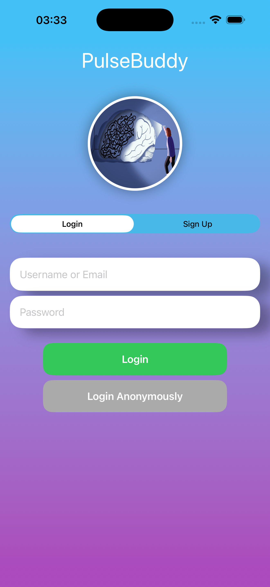
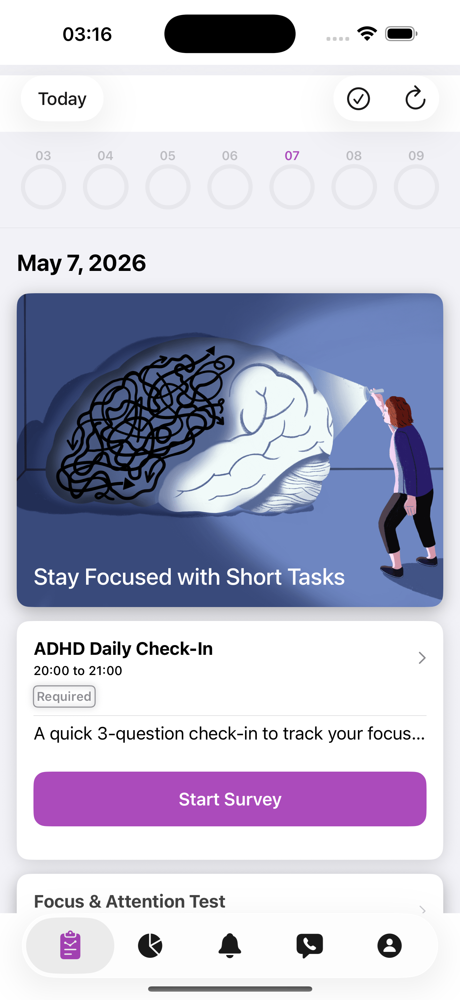
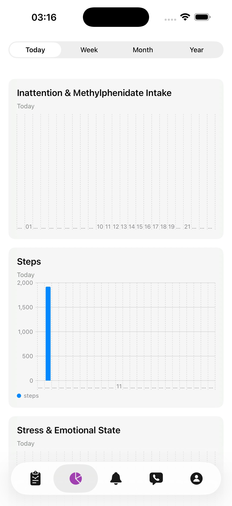
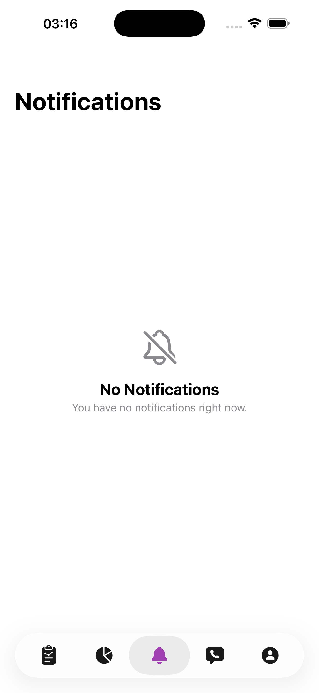
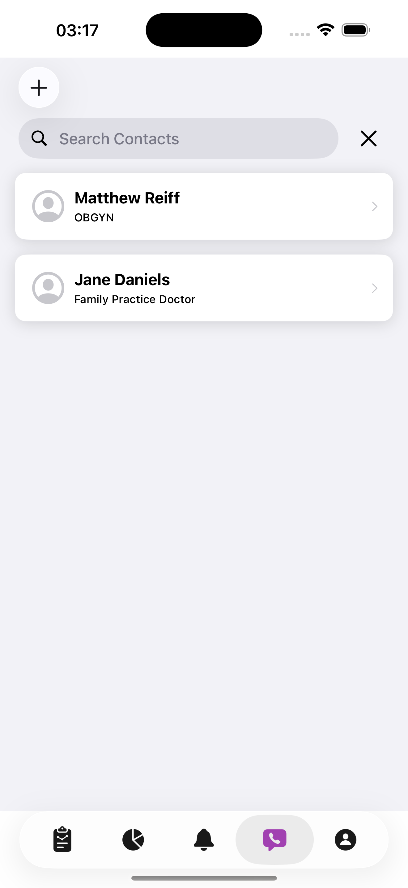
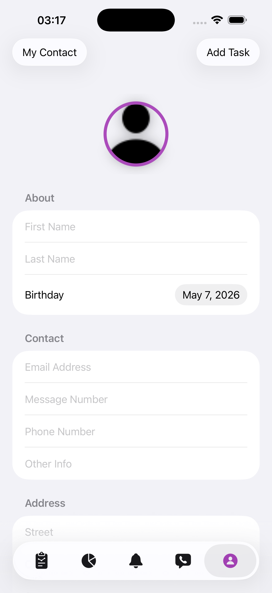

<!--
Name of your final project
-->
# PulseBuddy
     

## Description
<!--
Give a short description on what your project accomplishes and what tools is uses. Basically, what problems does it solve and why it's different from other apps in the app store.
-->
PulseBuddy is an iOS/watchOS care app for ADHD patients built on [CareKit](https://github.com/carekit-apple/CareKit) and [ParseCareKit](https://github.com/netreconlab/ParseCareKit). It addresses the core ADHD challenge of execution function — the gap between knowing what to do and actually doing it — through two complementary strategies: structured daily care tasks for active self-logging, and passive HealthKit-driven detection that nudges users to confirm activities they forgot to log. Clinicians get a separate view to manage patients and assign care plans. All data syncs to a Parse backend in real time.

Unlike generic habit trackers, PulseBuddy uses background `HKObserverQuery` observers to infer exercise sessions from step bursts and emotional states from heart rate anomalies, turning missed self-reports into one-tap confirmations rather than silent data loss.

### Demo Videos
<!--
Add the public link to your YouTube or video posted elsewhere.
-->
To learn more about this application, watch the videos below:

| Basic Function | Clinician - Patient | IKEB - Exercise | IKEB - Mood |
|---|---|---|---|
|  |  |  |  |

### Designed for the following users
<!--
Describe the types of users your app is designed for and who will benefit from your app.
-->
- **ADHD patients** who struggle with initiating tasks, remembering to log their health data, and maintaining consistent daily routines. The app reduces start friction and passively captures data even when users forget to log manually.
- **Clinicians** who need to monitor patient progress, assign and manage care plans, and send targeted push notifications to individual patients.

<!--
In addition, you can drop screenshots directly into your README file to add them to your README. Take these from your presentations.
-->
        

<!--
List all of the members who developed the project and
link to each members respective GitHub profile
-->
Developed by: 
- [Yoland Lyu](https://github.com/pnfwr) - `University of Southern California`, `Computer Engineering`
- [Yu-Chieh Huang](https://github.com/ycccccccccccc) - `University of Southern California`, `Computer Engineering`

ParseCareKit synchronizes the following entities to Parse tables/classes using [Parse-Swift](https://github.com/parse-community/Parse-Swift):

- [x] OCKTask <-> Task
- [x] OCKHealthKitTask <-> HealthKitTask 
- [x] OCKOutcome <-> Outcome
- [x] OCKRevisionRecord.KnowledgeVector <-> Clock
- [x] OCKPatient <-> Patient
- [x] OCKCarePlan <-> CarePlan
- [x] OCKContact <-> Contact

**Use at your own risk. There is no promise that this is HIPAA compliant and we are not responsible for any mishandling of your data**

<!--
What features were added by you, this should be descriptions of features added from the [Code](https://uk.instructure.com/courses/2030626/assignments/11151475) and [Demo](https://uk.instructure.com/courses/2030626/assignments/11151413) parts of the final. Feel free to add any figures that may help describe a feature. Note that there should be information here about how the OCKTask/OCKHealthTask's and OCKCarePlan's you added pertain to your app.
-->
## Contributions/Features

### ADHD-Tailored Onboarding (ResearchKit)
First-launch flow built on ResearchKit guides new ADHD patients through informed consent, HealthKit permissions (step count, heart rate, resting heart rate — required for passive detection), and automatic care plan seeding. The onboarding is fully customized with ADHD-specific language and instructions.

### Dual-Role Authentication
Users sign up or log in with either username or email. Role selection at sign-up (patient vs. clinician) determines which tab layout is shown on next launch — patients see their daily Care View, clinicians see their patient management dashboard.

### ADHD Daily Care Tasks (OCKTask / OCKHealthKitTask)
A structured daily card list spans six care plan buckets:

#### OCKTask

| Task | Card Type | Care Plan | Schedule |
|---|---|---|---|
| ADHD Daily Check-In | Survey | Health | Daily |
| Focus & Attention Test (Stroop) | Survey | Health | Daily |
| Morning Routine | Checklist | Health | Daily |
| Methylphenidate intake | Grid | Health | Three times Per Day |
| Log Distraction | Button | Behavioral Tracking | Daily |
| Log Mood | Button | Behavioral Tracking | Daily |
| Breathing Exercise | Instruction | Adaptive Feedback | Daily |
| Dectected Activity | Simple | Wellness | Daily |

#### OCKHealthKitTask

| Task | Card Type | Care Plan | Schedule |
|---|---|---|---|
| Steps | Numeric Progress | Health | Daily |
| Stress | Labeled Value | Health | Daily |
| Routine | Numeric Progress | Wellness | Daily |

### Cognitive Assessments (ResearchKit Surveys)
- **Stroop Test** — measures focused attention and cognitive flexibility via color-word interference
- **ADHD Daily Check-In** — 3-question structured symptom survey (inattention, hyperactivity, mood)

### Insights Tab (Swift Charts)
A dedicated Insights tab visualizes outcome history for steps, stress, attention, and routine using Swift Charts bar charts. Supports day/week/month interval switching. Medication intake and inattention scores are overlaid on the same chart for correlation analysis.

### CustomFeaturedContentView (Tip Card)
Replaced the default `OCKFeaturedContentView` tip card with a custom `CustomFeaturedContentViewController` subclass that accepts any URL at initialization. The card displays a curated ADHD resource and opens it in-browser on tap.

### Searchable Contact View
Replaced the default contact list with `CustomContactViewController` backed by `UISearchBarDelegate`, allowing patients and clinicians to filter contacts by name in real time.

### Profile Form View
All patient-editable fields (display name, given/family name, profile photo, phone, email, address, bio) are consolidated into a single SwiftUI `Form`. Changes sync to Parse immediately.

### Passive Detection — Background Exercise Logging
`ExerciseDetector` uses `HKObserverQuery` with background delivery to wake the app on new step samples and run a two-stage state machine:
- **Stage 1:** ≥ 300 steps in 5 minutes (outside active exercise tasks) → "Are you exercising?" push notification
- **Stage 2:** < 30 steps in 3 minutes → "Did you finish?" push notification; unconfirmed timeout writes an `isUnconfirmed=true` outcome after 15 minutes so no data is silently dropped

A persistent in-app banner appears while a session is being tracked. Full state is persisted to `UserDefaults` so the session survives app kill and relaunch.

### Passive Detection — Emotional State via Heart Rate Anomaly
`HeartRateAnomalyDetector` watches `.heartRate` samples in the background. If HR rises ≥ 25 bpm above the user's personalized resting baseline while movement (steps) is low, a single-stage "Elevated HR — strong emotion?" notification prompts the user to log a mood event. Both detectors share one `UNUserNotificationCenterDelegate` and suppress each other's prompts to avoid redundant nudges.

### Clinician Role — Signup, Patient Linking, and Care Plan Assignment
The Login screen includes a role selector (Patient / Clinician) during signup. Clinicians land on a dedicated `ClinicianTabView` with four tabs: Care Plan Management, Patient Management, Contacts, and Profile.

**Linking patients:** Clinicians send connection requests directly from their `OCKContact` list by email. A `Relationship` row is created in Parse with a publicRead + publicWrite ACL so the patient can claim the row on login without the clinician knowing their Parse `objectId` in advance. When the patient logs in, `Relationship.linkPendingForCurrentUser()` matches by email, fills in the patient's `objectId`, tightens the ACL to clinician + patient only, and delivers an in-app notification. Accepting auto-adds the clinician as an `OCKContact` in the patient's CareKit store.

**Assigning care plans:** From the patient detail screen, the clinician toggles care plans on/off. Each assignment writes a `CarePlanAssignment` row to Parse containing a `CarePlanSnapshot` — a JSON-serialized copy of the `OCKCarePlan` and all its `OCKTask`s captured at assignment time. A push notification is sent to the patient. On accept, `copyCarePlanToPatientStore` deserializes the snapshot and adds the plan and tasks to the patient's local CareKit store (idempotent). On reject, nothing is written to the patient's store.

## Final Checklist
<!--
This is from the checkist from the final [Code](https://uk.instructure.com/courses/2030626/assignments/11151475). You should mark completed items with an x and leave non-completed items empty
-->
- [x] Signup/Login screen tailored to app
- [x] Signup/Login with email address
- [x] Custom app logo
- [x] Custom styling
- [x] Add at least **5 new OCKTask/OCKHealthKitTasks** to your app
  - [x] Have a minimum of 7 OCKTask/OCKHealthKitTasks in your app
  - [x] 3/7 of OCKTasks should have different OCKSchedules than what's in the original app
- [x] Use at least 5/7 card below in your app
  - [x] InstructionsTaskView - Refocus Prompt, Breathing Exercise
  - [x] SimpleTaskView - Stretch, Take a Break, Weekly Reflection
  - [x] Checklist - Methylphenidate intake
  - [x] Button Log - Log Focus, Log Distraction, Log Mood, Log Sleep
  - [x] GridTaskView - not used as a seeded task type
  - [x] NumericProgressTaskView (SwiftUI) - Steps, Attention, Routine (OCKHealthKitTask)
  - [x] LabeledValueTaskView (SwiftUI) - Stress (OCKHealthKitTask)
- [x] Add the LinkView (SwiftUI) card to your app
- [x] Replace the current TipView with a class with CustomFeaturedContentView that subclasses OCKFeaturedContentView. This card should have an initializer which takes any link
- [x] Tailor the ResearchKit Onboarding to reflect your application
- [x] Add tailored check-in ResearchKit survey to your app
- [x] Add a new tab called "Insights" to MainTabView
- [x] Replace current ContactView with Searchable contact view
- [x] Change the ProfileView to use a Form view
- [x] Add at least two OCKCarePlan's and tie them to their respective OCKTask's and OCContact's 

## Wishlist features
<!--
Describe at least 3 features you want to add in the future before releasing your app in the app-store
-->
1. **IKBE Session Scaffolding** — 1-tap start for user-predefined focus session types (e.g. "Focus Writing", "Reading", "Chores") displayed as an iOS Live Activity on the Dynamic Island with elapsed time, and a watchOS End button. Each session stored as an `OCKOutcome` with `startedAt`, `endedAt`, and `autoEnded` flags for data quality tracking.

2. **Personalized Detection Thresholds** — replace fixed step/HR thresholds with baselines computed from each user's rolling 7-day HealthKit history, reducing false positives for both the exercise detector and the heart rate anomaly detector.

3. **Absence of Email Verification** - The system does not currently enforce email verification at registration, meaning a user could register with an email they do not own and claim invitations intended for another individual. Enabling Parse's built-in email verification would ensure that only the intended recipient can claim an invitation.

4. **Stale Data from Snapshot-Based Assignment** - Care plan assignments are stored as static JSON snapshots, so if a clinician updates the original plan after a patient has accepted it, the patient's local CareKit store does not receive the changes. Adopting a reference-based model with versioning would allow updates to propagate without losing the patient's existing outcome history.

## Challenges faced while developing
<!--
Describe any challenges you faced with learning Swift, your baseline app, or adding features. You can describe how you overcame them.
-->

**CareKit's per-day outcome uniqueness constraint** — CareKit rejects multiple `OCKOutcome`s for the same `(taskUUID, occurrenceIndex)`, making it impossible to write two detected exercise sessions on the same day as separate outcomes. We worked around this by appending each session as an additional `OCKOutcomeValue` (with JSON-encoded metadata) to the day's single outcome rather than creating new outcomes.

**Privacy-First Clinician-Patient Connection** - Establishing a clinician-patient connection is non-trivial because the system enforces strict data privacy — neither party can directly query the other's profile. The solution uses an invite-based flow where the clinician sends a connection request via the patient's email or phone number, and a pending Relationship record is created with the patient's identifier. When the patient logs in, the system automatically claims any pending relationships addressed to them, tightening the ACL and notifying both parties — all without ever exposing one user's data to unrelated users.

## Setup Your Parse Server

### Heroku
The easiest way to setup your server is using the [one-button-click](https://github.com/netreconlab/parse-hipaa#heroku) deployment method for [parse-hipaa](https://github.com/netreconlab/parse-hipaa).

## View your data in Parse Dashboard

### Heroku
The easiest way to setup your dashboard is using the [one-button-click](https://github.com/netreconlab/parse-hipaa-dashboard#heroku) deployment method for [parse-hipaa-dashboard](https://github.com/netreconlab/parse-hipaa-dashboard).
